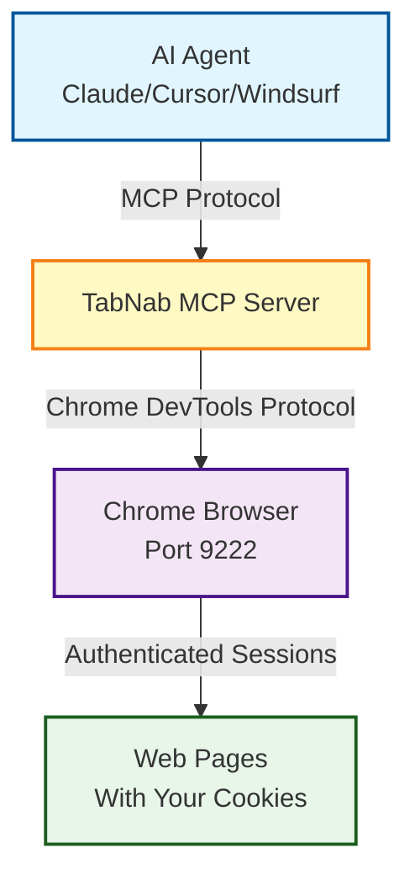

<div align="center">

<!-- Banner placeholder - replace with actual banner image when available -->
<!--  -->

# 🍪 TabNab

### *Give your AI your cookies, without giving it your password*

**Local MCP server that bridges AI agents with authenticated browser sessions**

[](LICENSE)
[](LICENSE-COMMERCIAL.md)
[](https://nodejs.org/)
[](https://modelcontextprotocol.io/)
[](https://www.typescriptlang.org/)

[🚀 Quick Start](#-quick-start) • [📦 Installation](#-installation) • [🛠️ Tools](#️-available-tools) • [📖 Docs](#-documentation)

</div>

---

## ✨ What is TabNab?

TabNab bridges the gap between AI agents (Claude, Cursor, Windsurf) and your **real browser sessions**. Instead of asking you to share passwords or API keys, TabNab lets AI agents use your existing authenticated browser sessions to:

- 🌐 Navigate websites with your logged-in credentials
- 📄 Extract clean content from complex web pages
- ⚡ Automate form filling and button clicks
- 📸 Capture screenshots for visual verification
- 🔒 Access sites behind authentication and Cloudflare

**The magic:** AI agents see what you see in Chrome, using your cookies and sessions, without ever knowing your passwords.

---

## 🎯 Key Features

<table>
<tr>
<td align="center" width="33%">

### 🔐 **Authenticated Access**

Connect to your real Chrome browser with all your cookies & sessions intact via Playwright (CDP). No password sharing required.

</td>
<td align="center" width="33%">

### 📝 **Clean Extraction**

Uses Readability.js + Turndown to convert messy HTML into pristine Markdown for AI consumption.

</td>
<td align="center" width="33%">

### 🎨 **Expanded MCP Tools**

Complete browser automation via MCP protocol: tabs, navigation, extraction, query, keyboard, screenshots, and confirmations.

</td>
</tr>
</table>

---

## 🚀 Quick Start

### 1️⃣ Prerequisites

- **Node.js 22+** ([Download](https://nodejs.org/))
- **pnpm** package manager (`npm install -g pnpm`)
- **Chrome/Chromium** browser

### 2️⃣ Start Chrome with Remote Debugging

> **Recommendation:** Use a dedicated Chrome profile for TabNab automation to isolate cookies and session data.

<details>
<summary><b>macOS</b></summary>

```bash
./scripts/start-chrome.sh
# or manually (dedicated profile recommended):
/Applications/Google\ Chrome.app/Contents/MacOS/Google\ Chrome --remote-debugging-port=9222 --user-data-dir="$HOME/Library/Application Support/TabNab-Chrome"
```
</details>

<details>
<summary><b>Linux</b></summary>

```bash
./scripts/start-chrome.sh
# or manually (dedicated profile recommended):
google-chrome --remote-debugging-port=9222 --user-data-dir="$HOME/.config/tabnab-chrome"
```
</details>

<details>
<summary><b>Windows</b></summary>

```powershell
.\scripts\start-chrome.ps1
# or manually (dedicated profile recommended):
"C:\Program Files\Google\Chrome\Application\chrome.exe" --remote-debugging-port=9222 --user-data-dir="%LOCALAPPDATA%\TabNabChrome"
```
</details>

### 3️⃣ Install & Build TabNab

```bash
git clone https://github.com/clduab11/tabnab.git
cd tabnab
pnpm install
pnpm run build
```

> TabNab uses Playwright to attach to your existing Chrome via CDP. No extra browser download is required.

### 4️⃣ Test the Connection

```bash
pnpm run test:milestone1
```

✅ You should see your active tab's URL and title!

---

## 📦 Installation

### As an MCP Server (Recommended)

Configure TabNab as an MCP server in your AI agent client.

<details>
<summary><b>Claude Desktop Configuration</b></summary>

**File Location:**
- macOS: `~/Library/Application Support/Claude/claude_desktop_config.json`
- Windows: `%APPDATA%\Claude\claude_desktop_config.json`
- Linux: `~/.config/Claude/claude_desktop_config.json`

**Configuration:**
```json
{
  "mcpServers": {
    "tabnab": {
      "command": "node",
      "args": ["/absolute/path/to/tabnab/dist/mcp/index.js"],
      "env": {
        "CHROME_DEBUG_PORT": "9222",
        "TABNAB_ALLOWED_DOMAINS": "example.com,app.example.com",
        "TABNAB_CONFIRMATION_MODE": "confirm-on-sensitive",
        "TABNAB_AUDIT_LOG_PATH": "/tmp/tabnab-audit.log"
      }
    }
  }
}
```
</details>

<details>
<summary><b>Cursor / Windsurf Configuration</b></summary>

Follow similar configuration patterns for other MCP-compatible clients. See `mcp-config.example.json` for reference.
</details>

### As a Standalone Electron App

```bash
pnpm run dev
```

Launches TabNab as a menu bar application.

---

## 🛠️ Available Tools

TabNab provides a focused set of MCP tools for browser automation with policy enforcement:

| Tool | Description | Input | Output |
|------|-------------|-------|--------|
| **`get_active_tab`** | Get URL and title of active tab | None | `{ ok, data: { url, title } }` |
| **`list_tabs`** | List all open tabs | None | `{ ok, data: [{ tabId, url, title }] }` |
| **`activate_tab`** | Set active tab | `{ tabId }` | `{ ok, data: { tabId } }` |
| **`navigate_and_extract`** | Navigate and extract (Markdown or sanitized DOM) | `{ url, extractionMode?, includeWarnings? }` | `{ ok, data: { url, title, markdown? html? } }` |
| **`click_element`** | Click an element | `{ selector }` | `{ ok, data: { message } }` |
| **`fill_input`** | Fill an input | `{ selector, value }` | `{ ok, data: { message } }` |
| **`keyboard_type`** | Type text | `{ text }` | `{ ok, data: { message } }` |
| **`press_key`** | Press a key | `{ key }` | `{ ok, data: { message } }` |
| **`wait_for_selector`** | Wait for selector | `{ selector, timeoutMs? }` | `{ ok, data: { found, url, title } }` |
| **`wait_for_navigation`** | Wait for navigation | `{ timeoutMs?, waitUntil? }` | `{ ok, data: { url, title } }` |
| **`query_selector_all`** | Extract text/attrs for lists/tables | `{ selector, attributes?, maxItems? }` | `{ ok, data: { items } }` |
| **`screenshot_tab`** | Capture screenshot | `{ fullPage?, path? }` | `{ ok, data: { screenshot?, path?, message } }` |
| **`confirm_action`** | Confirm/cancel pending actions | `{ confirmationToken, action? }` | `{ ok, data }` |
| **`reset_session`** | Reset step counter | None | `{ ok, data: { reset } }` |

<details>
<summary><b>🔍 Tool Details: get_active_tab</b></summary>

Returns the URL and title of the currently active browser tab.

**Example Output:**
```json
{
  "ok": true,
  "data": {
    "url": "https://github.com/clduab11/tabnab",
    "title": "TabNab - GitHub"
  },
  "warnings": []
}
```
</details>

<details>
<summary><b>🧭 Tool Details: navigate_and_extract</b></summary>

Navigate to a URL and extract clean Markdown content using Readability.js (or sanitized DOM).

**Example Input:**
```json
{
  "url": "https://example.com/article",
  "extractionMode": "readability_markdown"
}
```

**Example Output:**
```json
{
  "ok": true,
  "data": {
    "url": "https://example.com/article",
    "title": "Article Title",
    "markdown": "# Article Title\n\nClean extracted content..."
  },
  "warnings": []
}
```
</details>

<details>
<summary><b>🖱️ Tool Details: click_element</b></summary>

Click an element on the current page using a CSS selector.

**Example Input:**
```json
{
  "selector": "button.submit-btn"
}
```

**Example Output:**
```json
{
  "ok": true,
  "data": {
    "message": "Clicked element: button.submit-btn"
  },
  "warnings": []
}
```
</details>

<details>
<summary><b>✏️ Tool Details: fill_input</b></summary>

Fill an input field with the specified value. Clears existing content first.

**Example Input:**
```json
{
  "selector": "input[name='email']",
  "value": "user@example.com"
}
```

**Example Output:**
```json
{
  "ok": true,
  "data": {
    "message": "Filled input: input[name='email']"
  },
  "warnings": []
}
```
</details>

<details>
<summary><b>📸 Tool Details: screenshot_tab</b></summary>

Take a screenshot of the current tab. Returns base64-encoded data if no path specified.

**Example Input:**
```json
{
  "fullPage": false,
  "path": "/path/to/screenshot.png"
}
```

**Example Output:**
```json
{
  "ok": true,
  "data": {
    "path": "/path/to/screenshot.png",
    "message": "Screenshot saved to: /path/to/screenshot.png"
  },
  "warnings": []
}
```
</details>

---

## 🛡️ Policy & Safety Defaults

TabNab enforces a **domain allowlist** and **confirmation gates** by default. Actions that are blocked return `ok: false` with `reasonCodes`.

**Environment Variables:**
- `TABNAB_ALLOWED_DOMAINS="example.com,app.example.com"` (required for navigation/click/fill)
- `TABNAB_ALLOWED_PATH_PREFIXES="example.com:/billing;example.com:/settings"`
- `TABNAB_CONFIRMATION_MODE="auto|confirm-on-navigation|confirm-on-sensitive|always-confirm"`
- `TABNAB_AUDIT_LOG_PATH="/tmp/tabnab-audit.log"`
- `TABNAB_AUDIT_LOG_SELECTOR_MODE="truncate|hash|plaintext"`
- `TABNAB_MAX_STEPS="30"`

**Confirmation Flow:**
1. A tool may return `status: "needs_confirmation"` with a `confirmation_token`.
2. Call `confirm_action` to proceed or cancel.

**Prompt-Injection Warnings:**
Extraction tools scan extracted content for instruction-like phrases and return warnings when detected.

---

## 🏗️ Architecture



**Architecture Overview:**

```
/src
  /main       - Electron menu bar application entry point
  /mcp        - MCP server implementation (stdio transport)
  /browser    - Chrome DevTools Protocol connection manager (Playwright CDP)
  /extraction - HTML to Markdown conversion (Readability + Turndown)
```

---

## 💡 Use Cases

### 🤖 AI-Powered Web Automation
Let Claude or Cursor automate tedious browser tasks using your existing sessions:
- Fill out forms on authenticated sites
- Navigate multi-step workflows
- Extract data from pages behind login

### 📊 Authenticated Data Collection
Gather information from sites where you're already logged in:
- Social media analytics
- Dashboard data extraction
- Research behind paywalls

### 🧪 Testing & QA
Automate browser testing with real authentication:
- Test logged-in user flows
- Verify form submissions
- Capture visual regressions

### 🔍 Research & Analysis
Browse and analyze content with AI assistance:
- Summarize articles from subscription sites
- Extract structured data from complex pages
- Navigate and document web applications

---

## 📖 Documentation

- **[CLAUDE.md](CLAUDE.md)** - Development guide for AI agents
- **[IMPLEMENTATION.md](docs/IMPLEMENTATION.md)** - Technical architecture details
- **[CONTRIBUTING.md](docs/CONTRIBUTING.md)** - Contribution guidelines
- **[SECURITY.md](docs/SECURITY.md)** - Security considerations & reporting

---

## 🤝 Contributing

We welcome contributions! See [CONTRIBUTING.md](docs/CONTRIBUTING.md) for:

- Development environment setup
- Code style guidelines
- Pull request process
- Testing requirements

Before contributing, please review our:
- [Code of Conduct](docs/CONTRIBUTING.md#code-of-conduct) (respect & professionalism)
- [License Agreement](docs/CONTRIBUTING.md#license-and-copyright) (CLA terms)

---

## 🔧 Development

### Prerequisites
- Node.js 22 LTS or higher
- pnpm 9.15.4+
- Chrome/Chromium with remote debugging

### Commands

```bash
# Install dependencies
pnpm install

# Build project
pnpm run build

# Run type checking
pnpm run type-check

# Lint code
pnpm run lint

# Auto-fix linting issues
pnpm run lint:fix

# Format code
pnpm run format

# Run Electron app
pnpm run dev
```

---

## 💻 Technology Stack

| Technology | Purpose |
|------------|---------|
| **TypeScript 5.8** | Type-safe development with strict mode |
| **Electron 39** | Menu bar desktop application |
| **Playwright** | Browser automation via Chrome DevTools Protocol |
| **MCP SDK** | Model Context Protocol implementation |
| **Readability.js** | Intelligent content extraction from web pages |
| **Turndown** | HTML to Markdown conversion |
| **Zod** | Runtime type validation for all inputs |
| **Biome** | Fast linting and formatting |

---

## 📄 License

TabNab is available under a **dual-license model**:

### 🆓 Personal & Non-Commercial Use

**Free** under the [PolyForm Shield License 1.0.0](LICENSE)

✅ **Allowed:**
- Personal projects and learning
- Academic and educational use
- Non-profit organizations (501(c)(3) or equivalent)
- Open source projects (non-commercial)
- Evaluation and testing

### 💼 Commercial Use

**Requires a commercial license** for any profit-generating activity:

❗ **Requires License:**
- SaaS products using TabNab
- Internal business automation
- Consulting services using TabNab
- Any commercial product or service
- Use by for-profit organizations

**[📄 View Commercial License Terms →](LICENSE-COMMERCIAL.md)**

### ❓ Not Sure Which License You Need?

See our **[Commercial License FAQ](docs/COMMERCIAL-LICENSE-FAQ.md)** for detailed examples and guidance.

**Contact for Commercial Licensing:**
- Email: licensing@tabnab.dev *(placeholder)*
- GitHub: [Open an Issue](https://github.com/clduab11/tabnab/issues)

---

## ⚠️ Security Considerations

TabNab provides AI agents with powerful access to your authenticated browser sessions. Please understand the implications:

- **🔒 Local Only**: Only connects to `localhost` Chrome instances
- **🍪 Cookie Access**: AI agents can read your cookies and session tokens
- **⚡ Live Actions**: AI agents perform actions on your actual browser
- **🔐 Trust Required**: Only use with AI agents you trust completely

**Best Practices:**
- Use a dedicated Chrome profile for automation
- Monitor AI agent actions in real-time
- Don't use with highly sensitive accounts
- Review [SECURITY.md](docs/SECURITY.md) for detailed guidance

**Report Security Issues:** security@tabnab.dev *(placeholder)*

---

## 🙏 Acknowledgments

Built with:
- [Chrome DevTools Protocol](https://chromaticpdf.com/) for browser control
- [Readability.js](https://github.com/mozilla/readability) by Mozilla for content extraction
- [Turndown](https://github.com/mixmark-io/turndown) for HTML to Markdown conversion
- [Model Context Protocol](https://modelcontextprotocol.io/) by Anthropic

---

<div align="center">

**[⬆ Back to Top](#-tabnab)**

Made with ❤️ for the AI automation community

**TabNab** © 2025 TabNab Contributors

</div>
